<div align="center">

# 🧬 Spatial Transcriptomics Analysis Suite

### End-to-end workflows for Visium · MERFISH · Xenium using Scanpy & Squidpy

[](https://python.org)
[](https://scanpy.readthedocs.io)
[](https://squidpy.readthedocs.io)
[](https://jupyter.org)
[](LICENSE)

<br/>

> *Decoding the spatial language of cells — where gene expression meets tissue architecture.*

</div>

---

## 📖 Table of Contents

- [Overview](#-overview)
- [Repository Structure](#-repository-structure)
- [Notebook 1 — Scanpy: Visium + MERFISH](#-notebook-1--scanpy-visium--merfish)
- [Notebook 2 — Visium H&E with Squidpy](#-notebook-2--visium-he-with-squidpy)
- [Notebook 3 — Visium Fluorescence with Squidpy](#-notebook-3--visium-fluorescence-with-squidpy)
- [Notebook 4 — Xenium In Situ with Squidpy](#-notebook-4--xenium-in-situ-with-squidpy)
- [Key Concepts](#-key-concepts)
- [Installation](#-installation)
- [References](#-references)

---

## 🔭 Overview

This repository contains **four end-to-end spatial transcriptomics analysis notebooks** spanning the most widely used spatial omics platforms — **10x Visium**, **MERFISH**, and **10x Xenium In Situ**. Each notebook is a complete, reproducible workflow including data loading, QC, preprocessing, dimensionality reduction, clustering, and spatial statistics.

| Step | Description |
|---|---|
| 📥 **Data loading** | Platform-specific loaders (AnnData, SpatialData, Zarr) |
| 🔬 **Quality control** | Per-cell metrics, mitochondrial content, control probes |
| ⚙️ **Preprocessing** | Normalization, log-transform, HVG selection |
| 📊 **Dimensionality reduction** | PCA → k-NN graph → UMAP |
| 🔵 **Clustering** | Leiden community detection |
| 🗺️ **Spatial statistics** | Neighborhood enrichment, co-occurrence, Moran's I |
| 🧪 **Image analysis** | Morphology features, watershed cell segmentation |
| 💬 **Cell communication** | Ligand–receptor interaction screening |

---

## 📂 Repository Structure

```
spatial-transcriptomics-suite/
│
├── 01_scanpy_visium_merfish/
│   ├── Analysis_and_visualization_of_spatial_transcriptomics_data.ipynb
│   └── results/
│       ├── 01_qc_histograms.png
│       ├── 02_umap_clusters.png
│       ├── 03_spatial_qc_metrics.png
│       ├── 04_spatial_leiden_clusters.png
│       ├── 05_cropped_clusters_5_9.png
│       ├── 06_marker_gene_heatmap_cluster9.png
│       ├── 07_spatial_clusters_vs_CR2.png
│       ├── 08_spatial_COL1A2_SYPL1.png
│       ├── 09_merfish_umap.png
│       └── 10_merfish_spatial_embedding.png
│
├── 02_visium_hne/
│   ├── Analyze_Visium_H_E_data.ipynb
│   └── results/
│       ├── 01_spatial_annotated_clusters.png
│       ├── 02_image_features_vs_gene_clusters.png
│       ├── 03_neighborhood_enrichment.png
│       ├── 04_co_occurrence_hippocampus.png
│       ├── 05_ligrec_dotplot.png
│       └── 06_spatially_variable_genes_moranI.png
│
├── 03_visium_fluorescence/
│   ├── Analyze_Visium_fluorescence_data.ipynb
│   └── results/
│       ├── 01_spatial_gene_clusters.png
│       ├── 02_fluorescence_channels.png
│       ├── 03_watershed_segmentation.png
│       ├── 04_segmentation_feature_maps.png
│       └── 05_multi_feature_clustering.png
│
├── 04_xenium/
│   ├── Analyze_Xenium_Data.ipynb
│   └── results/
│       ├── 01_qc_histograms.png
│       ├── 02_umap_clusters.png
│       ├── 03_spatial_scatter_full_fov.png
│       ├── 04_centrality_scores.png
│       ├── 05_co_occurrence_cluster12.png
│       ├── 06_spatial_subsample.png
│       ├── 07_neighborhood_enrichment.png
│       └── 08_spatially_variable_genes_AREG_MET.png
│
└── README.md
```

---

## 📓 Notebook 1 — Scanpy: Visium + MERFISH

> 📎 [`01_scanpy_visium_merfish/`](01_scanpy_visium_merfish/)  
> 🔗 Tutorial: [scanpy-tutorials.readthedocs.io](https://scanpy-tutorials.readthedocs.io/en/latest/spatial/basic-analysis.html)

### 🎯 Objective
Introduces the core Scanpy spatial workflow on a **10x Visium Human Lymph Node** section, then applies the identical pipeline to **MERFISH** data — proving the Scanpy API is fully platform-agnostic.

### 📚 Datasets

| | Visium | MERFISH |
|---|---|---|
| **Tissue** | Human Lymph Node | Mouse Hypothalamus |
| **Resolution** | ~55 µm spots | ~10 µm cells |
| **Loader** | `sc.datasets.visium_sge()` | CSV counts + XLS coordinates |

### 🔬 Pipeline
```
Load SGE → QC (MT < 20%, counts 5k–35k) → Normalize → log1p
→ Top 2000 HVGs → PCA → Neighbors → UMAP → Leiden clustering
→ Spatial visualization → Marker gene heatmap
──── MERFISH branch ────
CSV + coordinate table → AnnData with obsm["spatial"] → same pipeline
```

---

### 📊 Results

**Fig 1 — Quality Control: UMI counts & detected genes per spot**

> Four histograms characterizing the Visium capture: `total_counts` full range (bell-shaped, peak ~20k UMI) and zoomed below 10k, `n_genes_by_counts` full range and zoomed below 4k. Spots with < 5,000 or > 35,000 counts and MT% > 20 are filtered out.

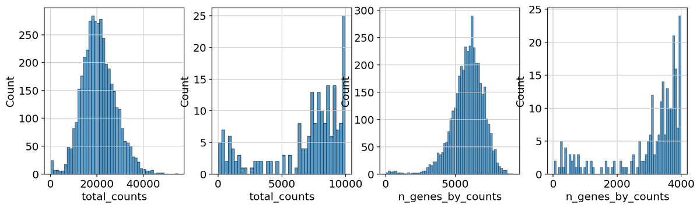

---

**Fig 2 — UMAP: total counts · gene counts · Leiden clusters**

> Ten Leiden clusters separate cleanly in transcriptional space. The QC coloring (left/center) does not recapitulate cluster boundaries — confirming that the structure reflects true biological diversity, not sequencing depth.

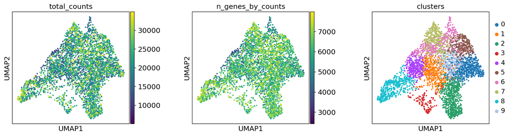

---

**Fig 3 — Spatial scatter: QC metrics on H&E tissue**

> Total UMI counts (left) and unique gene counts (right) projected onto the lymph node section. High-count spots (yellow) concentrate in the densely cellular germinal center — tissue morphology is already apparent from sequencing depth alone.

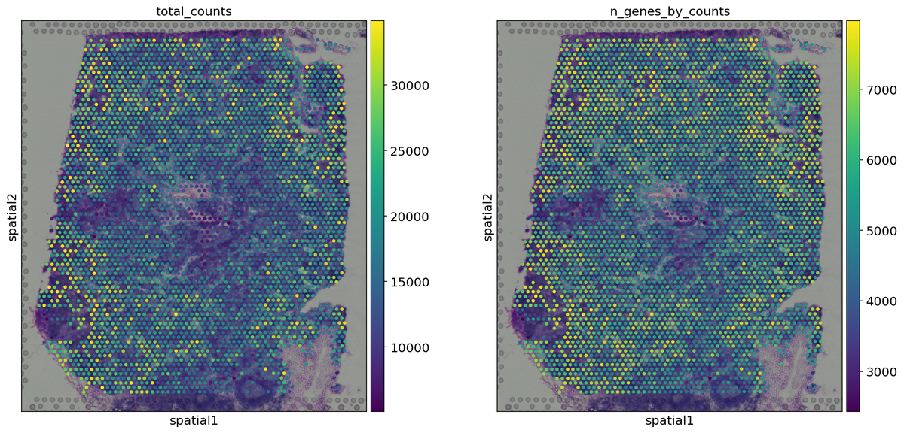

---

**Fig 4 — Spatial scatter: Leiden clusters on tissue**

> All 10 clusters mapped back onto the section. Spatially contiguous domains correspond to immunological compartments: B-cell follicles, T-cell zones, subcapsular sinus, and stromal regions — the transcriptional clusters faithfully recapitulate tissue anatomy.

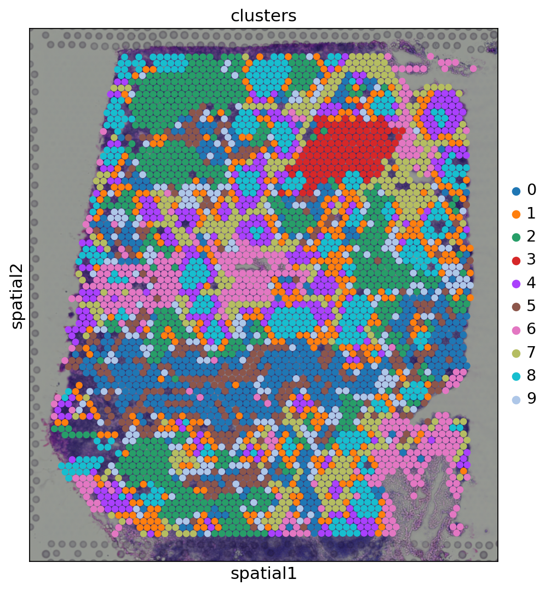

---

**Fig 5 — Cropped region: clusters 5 and 9 highlighted**

> A focused tissue crop isolating clusters 5 (brown) and 9 (light blue). Their localization along the outer capsule and lymphatic sinuses points to endothelial/lymphatic cell identity — confirmed by marker gene analysis below.

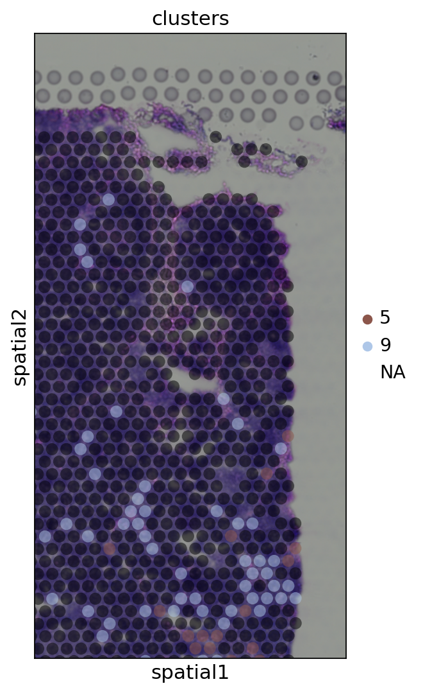

---

**Fig 6 — Marker gene heatmap: top 10 DEGs for cluster 9**

> t-test differential expression for cluster 9 versus all others. Top markers: **CCL21** (lymph node stromal attractant), **VWF** (von Willebrand factor, vascular endothelium), **ENG** (endoglin, endothelial marker), **ACKR1** (atypical chemokine receptor, lymphatic endothelium). This cluster is lymphatic/vascular endothelium.

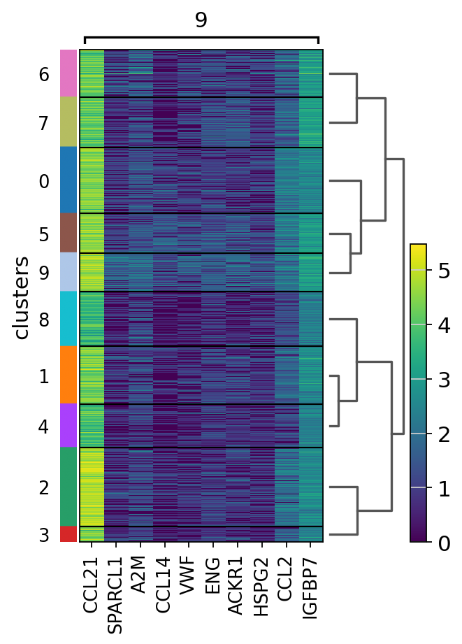

---

**Fig 7 — Spatial gene expression: clusters vs CR2**

> **CR2** (CD21, complement receptor 2) — a canonical follicular B-cell marker — co-localizes precisely with the cluster identified as B-cell follicles, validating the biological identity of the transcriptionally defined clusters.

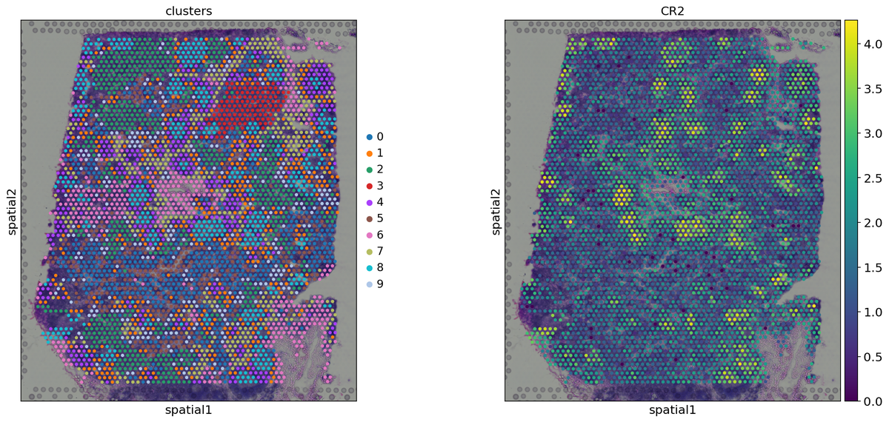

---

**Fig 8 — Spatial gene expression: COL1A2 and SYPL1**

> **COL1A2** (collagen type Iα2) is enriched in the perifollicular stroma, marking fibroblastic reticular cells. **SYPL1** (synaptophysin-like 1) shows a more diffuse follicular distribution — each gene's spatial pattern adds a layer of cell-type resolution beyond cluster labels.

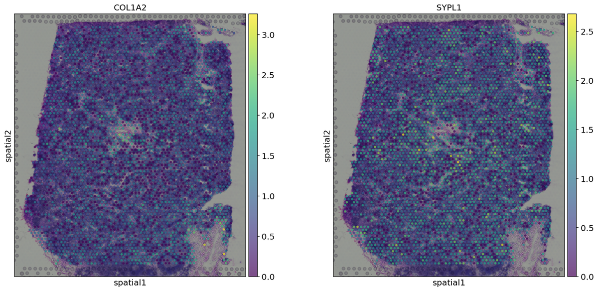

---

**Fig 9 — MERFISH UMAP (7 clusters, mouse hypothalamus)**

> The identical Scanpy pipeline applied to MERFISH data resolves 7 transcriptional clusters from mouse hypothalamus. The sparser UMAP topology reflects the smaller MERFISH cell count, but cluster separation is biologically meaningful.

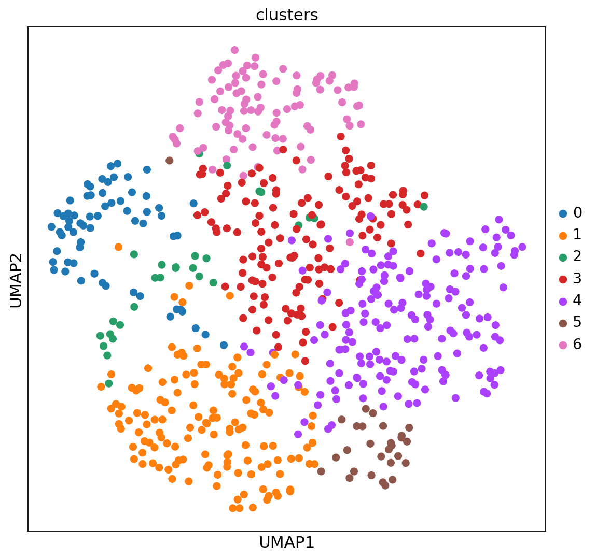

---

**Fig 10 — MERFISH spatial embedding (coordinates in µm)**

> Each cell plotted at its physical (x, y) centroid in microns. Unlike Visium's regular spot grid, MERFISH provides single-cell-resolution coordinates. The clusters do not form strongly exclusive spatial domains here — consistent with the intermingled nature of hypothalamic cell types.

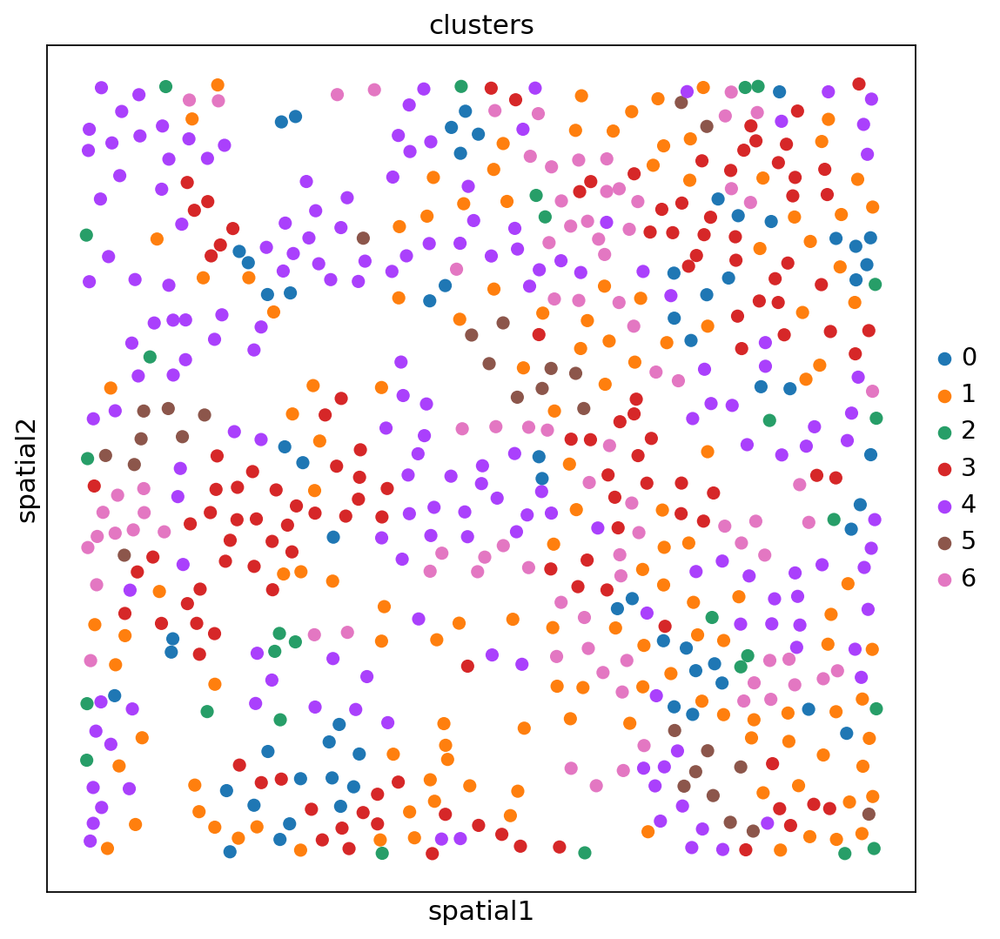

### 💡 Key Takeaways
- `sc.pl.spatial()` overlays any `.obs` column onto the tissue image — identical syntax for Visium and MERFISH
- The standard Scanpy recipe (normalize → log1p → HVG → PCA → neighbors → UMAP → Leiden) works out-of-the-box on both platforms
- Spatial projection of marker genes provides immediate anatomical validation of computationally defined clusters

---

## 📓 Notebook 2 — Visium H&E with Squidpy

> 📎 [`02_visium_hne/`](02_visium_hne/)  
> 🔗 Tutorial: [squidpy.readthedocs.io — Visium H&E](https://squidpy.readthedocs.io/en/stable/notebooks/tutorials/tutorial_visium_hne.html)

### 🎯 Objective
Extends spatial analysis to **rigorous spatial statistics** on a mouse brain coronal section — quantifying cluster co-localization, spatial gene autocorrelation, and ligand–receptor signalling using the Squidpy graph-based framework.

### 📚 Dataset

| Property | Details |
|---|---|
| **Platform** | 10x Genomics Visium |
| **Tissue** | Mouse Brain (coronal) |
| **Stain** | Hematoxylin & Eosin |
| **Regions** | 15 annotated anatomical areas |

### 🔬 Pipeline
```
Load H&E AnnData + ImageContainer → spatial scatter
→ Image feature extraction (summary stats, scale 1.0 & 2.0)
→ Feature-based Leiden clustering → compare to gene clusters
→ Spatial neighborhood graph → Neighborhood enrichment
→ Co-occurrence probability → Ligand-receptor (ligrec) → Moran's I
```

---

### 📊 Results

**Fig 1 — Spatial scatter: 15 annotated brain regions on H&E**

> Fifteen annotated anatomical regions mapped onto the Visium section: Cortex 1–5 (nested cortical layers), Hippocampus, Pyramidal layer, Dentate gyrus, Hypothalamus 1–2, Fiber tract, Striatum, Thalamus 1–2, and Lateral ventricle. This is the anatomical ground truth for all downstream spatial statistics.

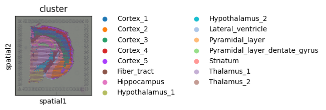

---

**Fig 2 — Image feature clusters vs gene-expression clusters**

> **Left**: Leiden clustering derived entirely from H&E image summary statistics (mean, std, quantiles per spot at two spatial scales). **Right**: transcriptomic clusters with anatomical labels. The strong spatial concordance between both independent modalities demonstrates that tissue morphology and transcriptomics encode the same biological information.

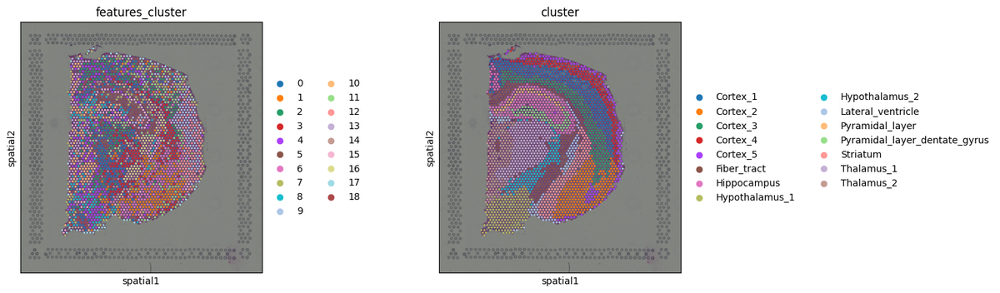

---

**Fig 3 — Neighborhood enrichment heatmap**

> z-score matrix of pairwise cluster co-localization across all 15 brain regions. Bright diagonal blocks (yellow) = strong self-enrichment (anatomically compact regions). Off-diagonal enrichment between Hippocampus and Pyramidal_layer reflects their direct anatomical adjacency. Cortex layers show graded enrichment with neighboring layers — exactly matching known laminar cortical organization.

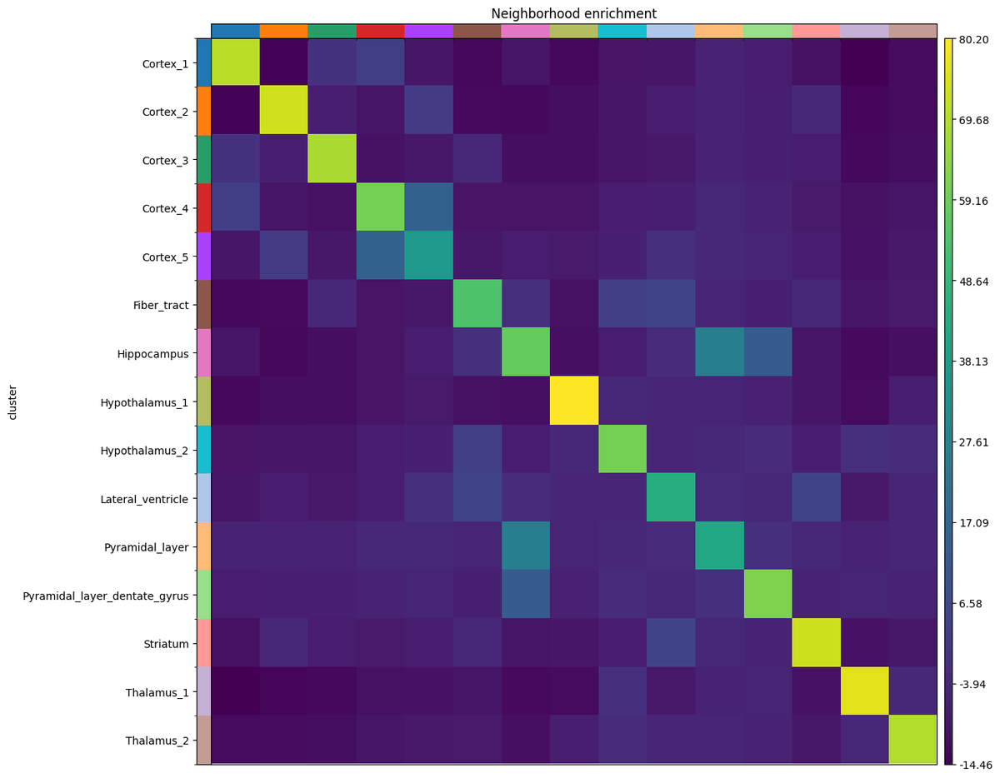

---

**Fig 4 — Co-occurrence probability: source = Hippocampus**

> The conditional probability p(cluster | Hippocampus) at increasing spatial radii. Pyramidal_layer and Pyramidal_layer_dentate_gyrus peak at short range (< 500 µm), consistent with anatomical proximity. Fiber_tract shows secondary enrichment at ~1000 µm. All curves converge to 1.0 at large distance (tissue-wide baseline).

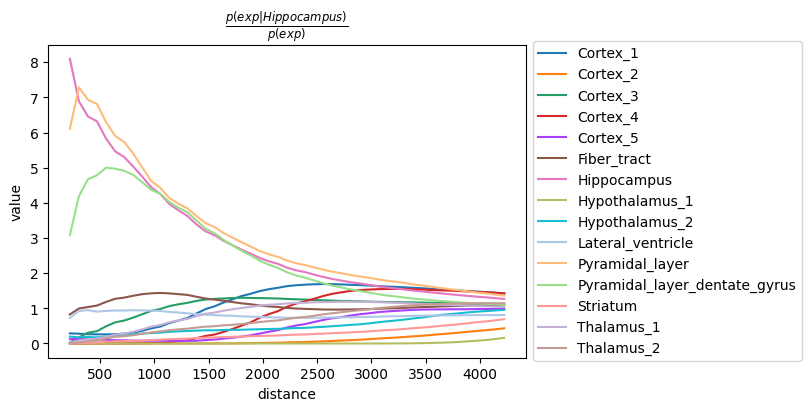

---

**Fig 6 — Spatially variable genes: Olfm1, Plp1, Itpka (top Moran's I)**

> The three highest-scoring genes by Moran's I spatial autocorrelation, alongside the cluster reference map. **Olfm1** enriches in hippocampal CA fields. **Plp1** (myelin proteolipid protein) strongly marks the Fiber_tract. **Itpka** concentrates in Striatum and Cortex. Every top spatially variable gene maps to a known region-specific marker — a complete biological validation of the method.

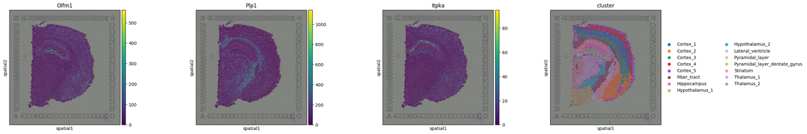

### 💡 Key Takeaways
- Image features at **two scales** (spot-level + tissue-context) are necessary for morphology-based clustering to match transcriptomic resolution
- Neighborhood enrichment gives a permutation-tested z-score — far more rigorous than visual co-localization
- Moran's I consistently recovers known region-specific markers, making it a reliable discovery tool for spatially variable genes

---

## 📓 Notebook 3 — Visium Fluorescence with Squidpy

> 📎 [`03_visium_fluorescence/`](03_visium_fluorescence/)  
> 🔗 Tutorial: [squidpy.readthedocs.io — Visium Fluorescence](https://squidpy.readthedocs.io/en/stable/notebooks/tutorials/tutorial_visium_fluo.html)

### 🎯 Objective
Demonstrates **cell segmentation from multi-channel immunofluorescence** and extraction of per-spot morphological features, bridging transcriptomics and protein-level spatial analysis.

### 📚 Dataset

| Property | Details |
|---|---|
| **Platform** | 10x Genomics Visium |
| **Tissue** | Mouse Brain (cropped section) |
| **Imaging** | 3-channel fluorescence (DAPI + 2 markers) |
| **Loader** | `sq.datasets.visium_fluo_adata_crop()` |

### 🔬 Pipeline
```
Load fluorescence Visium + ImageContainer → view channels
→ Gaussian smoothing → Watershed segmentation on DAPI
→ Segmentation feature extraction (cell count, intensities)
→ Multi-scale feature pipeline:
    features_orig    : summary + texture + histogram (scale=1.0, mask_circle=True)
    features_context : summary + histogram (scale=1.0)
    features_lowres  : summary + histogram (scale=0.25)
→ Leiden clustering per feature set → compare to gene clusters
```

---

### 📊 Results

**Fig 1 — Spatial scatter: gene-expression clusters on fluorescence image**

> Annotated transcriptomic clusters overlaid on the multi-channel fluorescence background. The distinctive Hippocampus arc (curved teal region, center-right) and Cortex layers are clearly visible both in the fluorescence signal and as spatially coherent gene clusters.

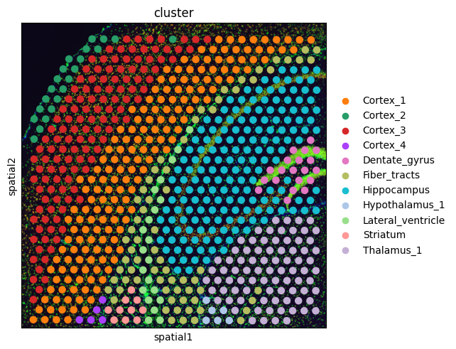

---

**Fig 2 — Multi-channel fluorescence image (channelwise)**

> Three independent fluorescence channels shown side by side. Channel 0 (left) shows dense DAPI nuclear signal — the hippocampal pyramidal layer lights up intensely. Channels 1 and 2 reveal sparser, cell-type-specific marker distributions across the section.

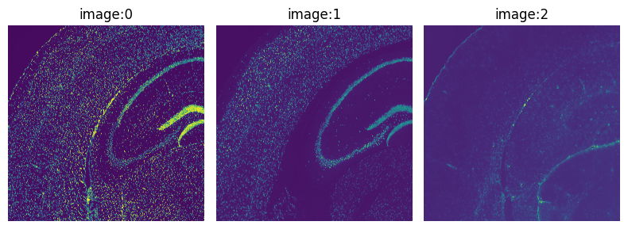

---

**Fig 3 — Watershed segmentation: raw DAPI vs. segmentation mask**

> A 500×500 µm crop before (left) and after (right) watershed segmentation. Each colored region in the mask is one individual segmented cell. Dense pyramidal layer cells (top of crop) are correctly resolved as separate instances; sparse cells in adjacent tissue are also cleanly captured.

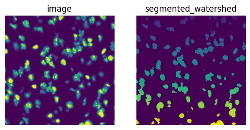

---

**Fig 4 — Segmentation-derived feature maps**

> Per-spot aggregated features from the segmentation mask. **Top-left**: cell count per spot (`segmentation_label`) — highest in the densely nucleated pyramidal layer arc. **Top-right**: gene-expression cluster reference. **Bottom row**: mean fluorescence intensity of channels 0 and 1 per spot — the pyramidal layer arc dominates channel 0, directly reflecting nuclear DAPI signal.

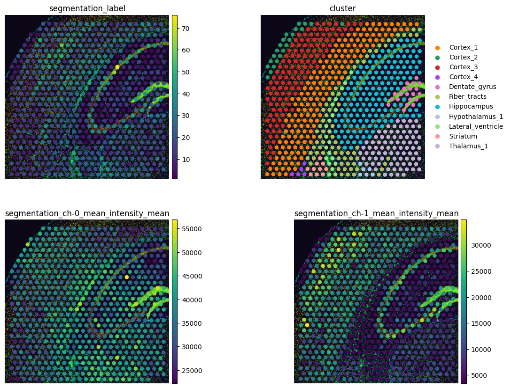

---

**Fig 5 — Multi-feature Leiden clustering comparison**

> Three image-derived Leiden clusterings (summary, histogram, texture) alongside the gene-expression reference. All three morphology-based clusterings independently recover the Hippocampus arc and broad cortical layers — demonstrating that fluorescence images alone carry sufficient biological information to delineate major brain regions without any gene expression data.

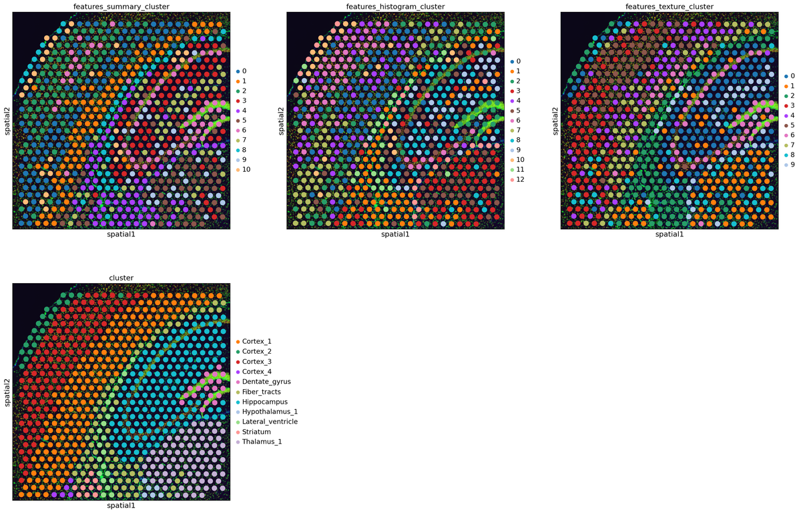

### 💡 Key Takeaways
- `mask_circle=True` restricts feature extraction to the circular Visium spot — critical for accurate per-spot morphology quantification
- **Texture features** capture microarchitectural variation (nuclear packing, size heterogeneity) missed by summary and histogram statistics alone
- Concordance between fluorescence-morphology clusters and transcriptomic clusters confirms that spatial multi-omics integration is biologically grounded

---

## 📓 Notebook 4 — Xenium In Situ with Squidpy

> 📎 [`04_xenium/`](04_xenium/)  
> 🔗 Tutorial: [squidpy.readthedocs.io — Xenium](https://squidpy.readthedocs.io/en/stable/notebooks/tutorials/tutorial_xenium.html)

### 🎯 Objective
Analyzes **single-cell resolution** spatial transcriptomics from the **10x Xenium In Situ** platform on human lung cancer tissue. Every dot is a real segmented cell — enabling direct single-cell spatial mapping of the tumor microenvironment.

### 📚 Dataset

| Property | Details |
|---|---|
| **Platform** | 10x Genomics Xenium In Situ v2 |
| **Tissue** | Human Lung Cancer (NSCLC), 2 FOVs |
| **Gene panel** | ~300 targeted genes |
| **Data size** | ~8 GB download |
| **Format** | SpatialData / Zarr |

### 🔬 Pipeline
```
Download bundle → xenium() parser → Zarr store
→ Extract AnnData table (obsm["spatial"] = cell centroids)
→ QC: transcripts/cell, genes/cell, cell area, nucleus ratio, control probe %
→ Filter → Normalize → log1p → PCA → Neighbors → UMAP → Leiden
→ Delaunay spatial neighborhood graph
→ Centrality scores → Co-occurrence → Neighborhood enrichment → Moran's I
```

---

### 📊 Results

**Fig 1 — Quality control: four-panel cell characterization**

> QC at true single-cell resolution: **total transcripts per cell** (log-normal, peak ~50), **unique genes per cell** (peak ~25), **cell area in µm²** (right-skewed, cells vary widely in size), **nucleus-to-cell area ratio** (broadly distributed, centered ~0.45). Control probe counts were < 1% of total — confirming high assay specificity.

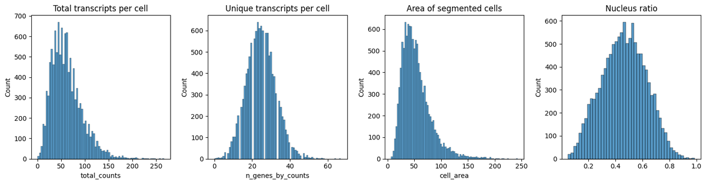

---

**Fig 2 — UMAP: 13 Leiden clusters at single-cell resolution**

> Each point is one segmented cell. A large central cloud spans the bulk of lung cell types (epithelial, stromal, immune). A distinctly separated cluster 12 (pink, bottom-right) with unique transcriptional identity — likely a rare specialized cell population — stands clearly apart from all others.

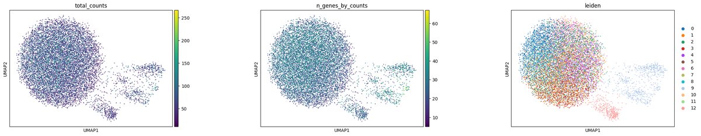

---

**Fig 3 — Spatial scatter: single-cell cluster map (full FOV)**

> Each cell plotted at its physical (x, y) centroid across both fields of view. At Xenium single-cell resolution the **tumor microenvironment architecture** is directly visible: dense tumor cell nests (right), stromal barriers, cell-sparse regions (lung alveoli, top-left), and scattered immune infiltrates. Cluster 12 (pink) is spatially restricted to specific focal zones.

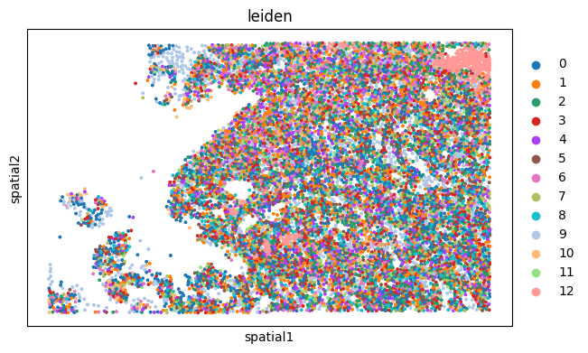

---

**Fig 4 — Centrality scores: three graph-theoretic measures**

> Centrality measures computed from the Delaunay spatial neighborhood graph for each cluster. **Average clustering** = how tightly cells form local groups. **Closeness centrality** = how central in the tissue. **Degree centrality** = fraction of cross-cluster connections. Cluster 0 leads all three — consistent with a spatially central, well-connected cell type such as alveolar epithelium or stromal fibroblasts.

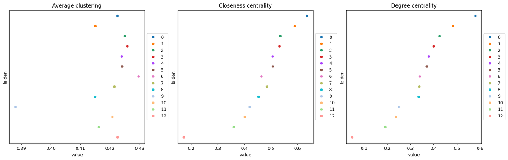

---

**Fig 5 — Co-occurrence probability: source = cluster 12**

> Cluster 12 shows dramatic self-co-occurrence (~16×) at very short distances (< 100 µm), collapsing to baseline by ~300 µm. This sharp short-range signature means cluster 12 cells form tight focal aggregates — characteristic of organized microanatomical structures such as tertiary lymphoid structures or compact tumor cell clusters.

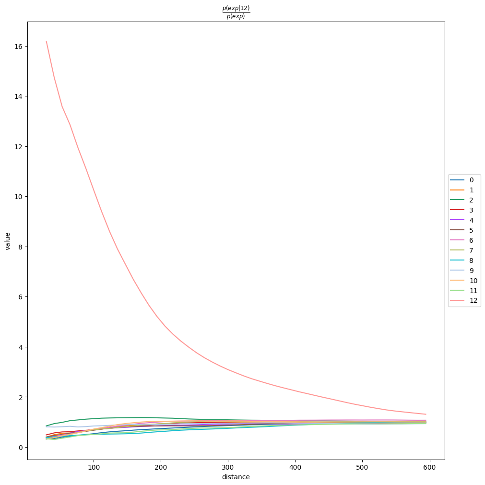

---

**Fig 6 — Spatial scatter: 50% subsampled cells**

> The 50% subsample used for computationally intensive analyses preserves overall tissue architecture and cluster distribution faithfully — validating its use for co-occurrence and Moran's I calculations.

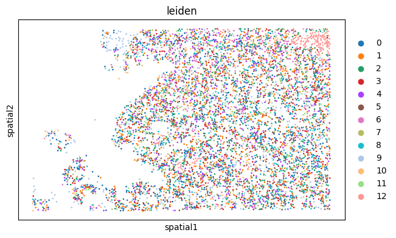

---

**Fig 7 — Neighborhood enrichment + spatial reference**

> **Left heatmap**: cluster 12 shows extreme self-enrichment (z > 100) and strong depletion with all other clusters — quantitatively confirming its spatially isolated, aggregate nature. Other clusters show moderate mutual enrichment, reflecting the heterogeneous mixed composition of lung tumor stroma. **Right**: spatial scatter reference for the subsample.

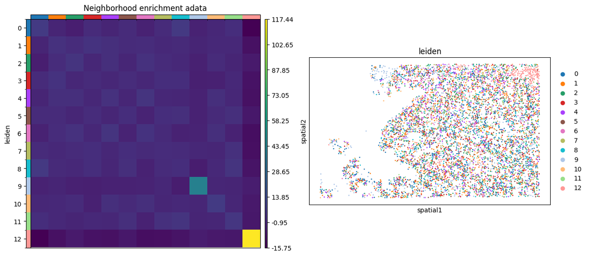

---

**Fig 8 — Spatially variable genes: AREG and MET (top Moran's I)**

> Highest Moran's I genes in the lung cancer dataset: **AREG** (amphiregulin — an EGFR ligand overexpressed in NSCLC and associated with resistance to EGFR inhibitors) and **MET** (hepatocyte growth factor receptor — a known lung cancer oncogene and active therapeutic target). Both show focal, spatially clustered expression consistent with specific tumor cell subpopulations.

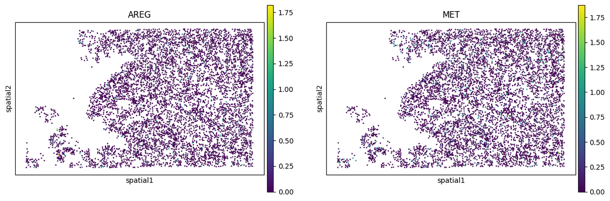

### 💡 Key Takeaways
- `spatialdata-io.xenium()` + Zarr is the canonical Xenium entry point — it preserves transcript coordinates, cell segmentation masks, and morphology images in a single object
- **Delaunay triangulation** (`coord_type='generic', delaunay=True`) is better than fixed k-NN for Xenium because it respects local cell geometry
- Control probe % must be < 1% — flag and investigate any sample exceeding this threshold
- Top Moran's I hits (AREG, MET) are clinically actionable lung cancer targets — spatial autocorrelation analysis directly feeds translational discovery

---

## 🔑 Key Concepts

<details>
<summary><b>📐 AnnData object structure</b></summary>

```
AnnData
├── X                  — (cells × genes) sparse count matrix
├── obs                — per-cell metadata: QC metrics, cluster labels
├── var                — per-gene metadata: highly_variable, mt flag
├── obsm["spatial"]    — (N × 2) spatial coordinates (µm or pixels)
├── obsm["X_pca"]      — PCA embedding
├── obsm["X_umap"]     — UMAP embedding
├── uns["spatial"]     — tissue image + scale factors (Visium only)
└── obsp               — spatial connectivity / distance matrices
```
</details>

<details>
<summary><b>🗺️ Spatial statistics methods</b></summary>

| Method | What it measures | Squidpy function |
|---|---|---|
| Neighborhood enrichment | z-score of cluster co-localization | `sq.gr.nhood_enrichment` |
| Co-occurrence | Probability cluster B is near A at radius r | `sq.gr.co_occurrence` |
| Moran's I | Spatial autocorrelation of gene expression | `sq.gr.spatial_autocorr` |
| Centrality scores | Graph-theoretic position of clusters | `sq.gr.centrality_scores` |
| Ligand-receptor | Permutation-based L-R significance | `sq.gr.ligrec` |
| Image features | Summary/texture/histogram stats per spot | `sq.im.calculate_image_features` |
</details>

<details>
<summary><b>🏗️ Platform comparison</b></summary>

| | Visium | MERFISH | Xenium |
|---|---|---|---|
| Resolution | ~55 µm spots | ~10 µm cells | Single-cell |
| Gene panel | Whole transcriptome | Targeted ~500 | Targeted ~300 |
| Image | H&E or fluorescence | FISH | H&E + IF |
| Format | AnnData | CSV + coords | SpatialData Zarr |
| Cells/spots | 3k–5k | 1k–10k | 10k–100k+ |
</details>

---

## ⚙️ Installation

```bash
git clone https://github.com/<your-username>/spatial-transcriptomics-suite.git
cd spatial-transcriptomics-suite

conda create -n spatial python=3.10
conda activate spatial

pip install scanpy squidpy anndata
pip install spatialdata spatialdata-io spatialdata-plot ome-zarr
pip install seaborn leidenalg igraph openpyxl

jupyter lab
```

> ⚠️ **Xenium notebook** requires ~8 GB disk + ~16 GB RAM. Use `fraction=0.1` in the subsample step for a quick test run.

---

## 📚 References

| Resource | Link |
|---|---|
| Scanpy spatial tutorial | https://scanpy-tutorials.readthedocs.io/en/latest/spatial/basic-analysis.html |
| Squidpy Visium H&E | https://squidpy.readthedocs.io/en/stable/notebooks/tutorials/tutorial_visium_hne.html |
| Squidpy Visium Fluorescence | https://squidpy.readthedocs.io/en/stable/notebooks/tutorials/tutorial_visium_fluo.html |
| Squidpy Xenium | https://squidpy.readthedocs.io/en/stable/notebooks/tutorials/tutorial_xenium.html |
| Squidpy paper | Palla *et al.*, *Nature Methods* 2022 |
| Scanpy paper | Wolf *et al.*, *Genome Biology* 2018 |
| SpatialData paper | Marconato *et al.*, *Nature Methods* 2024 |

---

<div align="center">

**Made with 🔬 and ☕ — spatial transcriptomics, one spot at a time.**

⭐ *Star this repo if you found it useful!*

</div>
